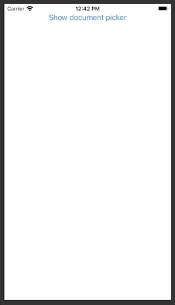

**StackNavigation** is a re-implementation of NavigationView without reliance on UIKit.



# Example

```swift
struct ContentView: View {

  var body: some View {
    StackNavigation {
      VStack {
        …
        StackNavigation(destination: Text("Destination") {
          Text("Link")
        }
      }
    }
  }
}
```

For more please check the [documentation folder](doc).

# Installation via SPM

In _XCode_ add the following URL to your project's _Swift Package_ dependencies:

 `https://github.com/swiftuilib/stack-navigation`
